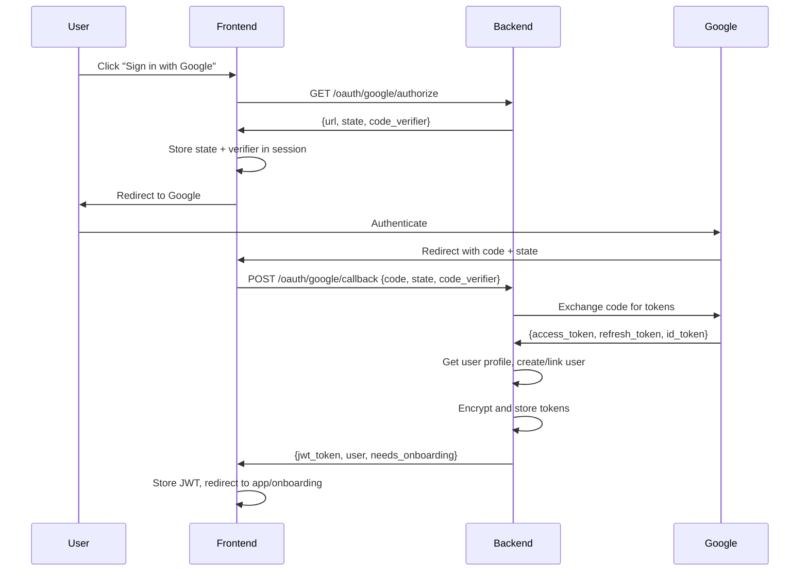
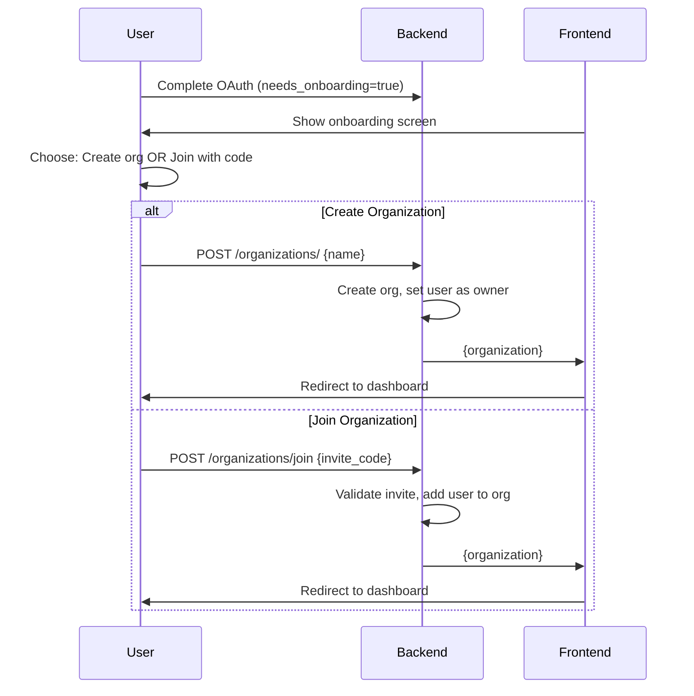
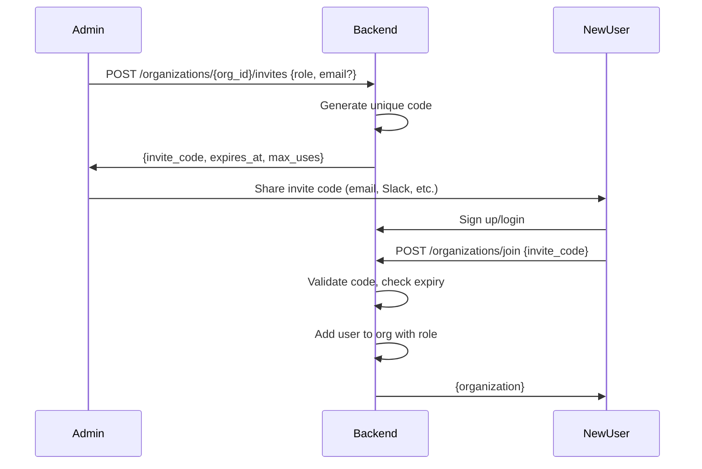

# OAuth Authentication & Multi-Tenancy Implementation

**Status**: ✅ Complete (Backend Ready)
**Date**: 2025-11-15
**Version**: 1.0

## Overview

Paperbase now supports multi-provider authentication (Google, Microsoft, and email/password) with full multi-tenancy organization management. Users can sign in with their preferred method, create or join organizations, and manage teams with role-based access control.

## Features Implemented

### Authentication Methods
✅ **Email/Password** - Traditional authentication with bcrypt hashing
✅ **Google OAuth 2.0** - Sign in with Google
✅ **Microsoft OAuth 2.0** - Sign in with Microsoft/Azure AD
✅ **Provider Linking** - Link multiple auth methods to one account
✅ **JWT Tokens** - 24-hour session tokens
✅ **API Keys** - Long-lived tokens for scripts/MCP

### Organization Management
✅ **Multi-Tenancy** - Complete data isolation by organization
✅ **Organization CRUD** - Create, read, update, delete organizations
✅ **Invitation System** - Invite users via unique codes
✅ **Role Management** - Owner, Admin, Member roles
✅ **Member Management** - Add, remove, change roles
✅ **Ownership Transfer** - Transfer organization ownership

### Security Features
✅ **CSRF Protection** - State parameter validation
✅ **PKCE Flow** - Proof Key for Code Exchange
✅ **Token Encryption** - Encrypted OAuth tokens at rest
✅ **Row-Level Security** - Filter all queries by organization_id
✅ **Secure Password Hashing** - bcrypt with salt
✅ **Email Verification** - OAuth providers verify emails automatically

## Architecture

### Database Models

#### User Model (Enhanced)
```python
class User(Base):
    # Existing fields
    id, email, name, hashed_password, is_active, is_admin

    # NEW: OAuth fields
    auth_provider: str  # "password", "google", "microsoft"
    provider_user_id: str  # OAuth sub/id
    provider_metadata: str  # Encrypted tokens
    provider_linked_at: datetime

    # NEW: Organization membership
    org_id: int  # Foreign key to organizations
    organization_role: str  # "owner", "admin", "member"
    onboarding_completed: bool
    email_verified: bool
```

#### Organization Model (Enhanced)
```python
class Organization(Base):
    id, name, slug, is_active

    # NEW: Ownership
    owner_id: int  # Foreign key to users

    # Relationships
    users, settings, roles, invites
```

#### OrganizationInvite Model (New)
```python
class OrganizationInvite(Base):
    id, organization_id, invite_code
    email: str  # Optional: restrict to specific email
    role: str  # "owner", "admin", "member"
    max_uses: int  # 1 = single-use
    current_uses: int
    expires_at: datetime
    is_active: bool
```

#### Multi-Tenancy Support
All major models now include `organization_id`:
- `Document.organization_id`
- `Schema.organization_id` (templates)
- `PhysicalFile.organization_id`

### API Endpoints

#### OAuth Endpoints (`/api/auth/oauth/`)

| Endpoint | Method | Description |
|----------|--------|-------------|
| `/{provider}/authorize` | GET | Get OAuth authorization URL |
| `/{provider}/callback` | POST | Complete OAuth flow, create/login user |
| `/link-provider` | POST | Link OAuth provider to existing account |
| `/refresh` | POST | Refresh OAuth access tokens |
| `/unlink-provider` | DELETE | Unlink OAuth provider |

**Supported Providers**: `google`, `microsoft`

#### Organization Endpoints (`/api/organizations/`)

| Endpoint | Method | Description |
|----------|--------|-------------|
| `/` | POST | Create new organization |
| `/my` | GET | Get current user's organization |
| `/{org_id}` | GET | Get organization details |
| `/{org_id}` | PUT | Update organization |
| `/{org_id}` | DELETE | Delete organization (owner only) |
| `/{org_id}/members` | GET | List organization members |
| `/{org_id}/members/{user_id}` | DELETE | Remove member |
| `/{org_id}/members/{user_id}/role` | PUT | Update member role |
| `/{org_id}/transfer-ownership` | POST | Transfer ownership |
| `/{org_id}/invites` | POST | Create invitation |
| `/{org_id}/invites` | GET | List invitations |
| `/join` | POST | Accept invitation |
| `/{org_id}/invites/{invite_id}` | DELETE | Revoke invitation |

## Authentication Flows

### 1. Google OAuth Flow



### 2. Organization Onboarding Flow



### 3. Invitation Flow



## Setup Instructions

### 1. Install Dependencies

```bash
cd backend
pip install -r requirements.txt
```

New dependencies:
- `authlib==1.3.0` - OAuth 2.0 client
- `cryptography==41.0.7` - Token encryption

### 2. Configure OAuth Providers

#### Google OAuth

1. Go to [Google Cloud Console](https://console.cloud.google.com/apis/credentials)
2. Create a new OAuth 2.0 Client ID (Web application)
3. Add authorized redirect URI: `http://localhost:5173/auth/callback/google`
4. Copy Client ID and Client Secret to `.env`:

```env
GOOGLE_CLIENT_ID=your-client-id.apps.googleusercontent.com
GOOGLE_CLIENT_SECRET=your-client-secret
GOOGLE_REDIRECT_URI=http://localhost:5173/auth/callback/google
```

#### Microsoft OAuth

1. Go to [Azure Portal](https://portal.azure.com/#blade/Microsoft_AAD_RegisteredApps/ApplicationsListBlade)
2. Register a new application
3. Add redirect URI: `http://localhost:5173/auth/callback/microsoft`
4. Create a client secret
5. Copy Application (client) ID and client secret to `.env`:

```env
MICROSOFT_CLIENT_ID=your-client-id
MICROSOFT_CLIENT_SECRET=your-client-secret
MICROSOFT_TENANT_ID=common
MICROSOFT_REDIRECT_URI=http://localhost:5173/auth/callback/microsoft
```

### 3. Generate Encryption Key

OAuth refresh tokens are encrypted before storage. Generate a key:

```bash
python -c "from cryptography.fernet import Fernet; print(Fernet.generate_key().decode())"
```

Add to `.env`:
```env
ENCRYPTION_KEY=your-generated-key-here
```

### 4. Run Database Migration

```bash
cd backend
python migrations/add_oauth_and_organizations.py
```

This migration:
- Adds OAuth fields to `users` table
- Adds `owner_id` to `organizations` table
- Adds `organization_id` to `documents`, `schemas`, `physical_files`
- Creates `organization_invites` table
- Creates default organization
- Migrates existing data to default organization

### 5. Update Frontend (Pending)

Frontend integration pending. Required components:
- OAuth redirect handlers (`/auth/callback/{provider}`)
- Onboarding flow (create org or join with code)
- Organization settings page
- Member management UI
- Invite generation/sharing UI

## Security Considerations

### OAuth Security
✅ **PKCE Flow** - Prevents authorization code interception
✅ **State Parameter** - CSRF protection
✅ **Token Encryption** - Refresh tokens encrypted at rest (Fernet AES-128)
✅ **Scope Minimization** - Only request email, profile, openid
✅ **HTTPS Required** - Production must use HTTPS redirect URIs

### Multi-Tenancy Security
✅ **Row-Level Security** - All queries filtered by `organization_id`
✅ **API Isolation** - Users can only access their org's data
✅ **Owner Protection** - Cannot remove organization owner
✅ **Role Enforcement** - Owner/Admin required for sensitive operations
✅ **Invite Validation** - Email restriction, expiration, usage limits

### Token Security
✅ **JWT Expiration** - 24-hour expiry (configurable)
✅ **Secure Cookies** - HTTPOnly, SameSite recommended for production
✅ **No Refresh Token Rotation** - Currently using static refresh tokens
⚠️ **Token Blacklist** - Not implemented (logout is client-side only)

### Password Security
✅ **bcrypt Hashing** - Password hashing with salt
✅ **Min 8 Characters** - Enforced in validation
⚠️ **No Complexity Requirements** - Consider adding for production
⚠️ **No Rate Limiting** - Consider adding to prevent brute-force

## Testing

### Manual Testing Checklist

**OAuth Flow (Google)**
- [ ] Click "Sign in with Google" → Redirects to Google
- [ ] Authenticate with Google → Redirects back with code
- [ ] Backend exchanges code → Creates user, returns JWT
- [ ] User profile populated (email, name)
- [ ] Tokens encrypted and stored

**OAuth Flow (Microsoft)**
- [ ] Sign in with Microsoft works end-to-end
- [ ] Email normalization (mail vs userPrincipalName)

**Organization Creation**
- [ ] Create organization → User becomes owner
- [ ] Organization slug auto-generated
- [ ] Cannot create org if already member (non-admin)

**Invitation System**
- [ ] Admin creates invite → Unique code generated
- [ ] Non-member accepts invite → Joins org with role
- [ ] Email-restricted invite → Only that email can use
- [ ] Expired invite → Returns error
- [ ] Max uses enforced → Invite expires after N uses

**Member Management**
- [ ] List members → Shows all org members
- [ ] Change member role → Owner/Admin can change roles
- [ ] Remove member → Owner/Admin can remove (except owner)
- [ ] Transfer ownership → Owner can transfer to member

**Multi-Tenancy**
- [ ] User in Org A cannot see Org B's documents
- [ ] User in Org A cannot see Org B's templates
- [ ] API filters by organization_id automatically

### Integration Tests

```bash
pytest tests/test_oauth_service.py
pytest tests/test_organization_service.py
pytest tests/test_oauth_api.py
pytest tests/test_organizations_api.py
```

## Environment Variables Reference

| Variable | Required | Description | Example |
|----------|----------|-------------|---------|
| `SECRET_KEY` | Yes | JWT signing key | `your-secret-key-min-32-chars` |
| `JWT_ALGORITHM` | No | JWT algorithm | `HS256` (default) |
| `JWT_EXPIRATION_HOURS` | No | JWT expiry | `24` (default) |
| `GOOGLE_CLIENT_ID` | OAuth | Google OAuth client ID | `123-abc.apps.googleusercontent.com` |
| `GOOGLE_CLIENT_SECRET` | OAuth | Google OAuth secret | `GOCSPX-...` |
| `GOOGLE_REDIRECT_URI` | OAuth | Google callback URL | `http://localhost:5173/auth/callback/google` |
| `MICROSOFT_CLIENT_ID` | OAuth | Microsoft app ID | `abc123-...` |
| `MICROSOFT_CLIENT_SECRET` | OAuth | Microsoft secret | `xyz789~...` |
| `MICROSOFT_TENANT_ID` | OAuth | Azure tenant | `common` (any account) or specific tenant |
| `MICROSOFT_REDIRECT_URI` | OAuth | Microsoft callback URL | `http://localhost:5173/auth/callback/microsoft` |
| `ENCRYPTION_KEY` | Yes | Fernet encryption key | `generated-fernet-key` |

## Migration from Existing System

If you have existing users/documents:

1. **Backup database** before running migration
2. **Run migration** - Creates default organization (id=1)
3. **All existing users** → Assigned to default organization
4. **All existing documents** → Assigned to default organization
5. **First user** → Becomes owner of default organization
6. **Other users** → Become members of default organization

Users can later:
- Create their own organizations (leave default org)
- Invite others to their new organization
- Transfer ownership of default org

## Troubleshooting

### OAuth Redirect Mismatch
**Error**: `redirect_uri_mismatch`
**Fix**: Ensure redirect URI in `.env` matches exactly what's configured in Google/Microsoft console (including protocol, port, path)

### Token Decryption Failed
**Error**: `Decryption failed`
**Fix**: Ensure `ENCRYPTION_KEY` is set and hasn't changed. If key rotated, users must re-authenticate.

### Invite Code Invalid
**Error**: `Invalid invite code`
**Fix**: Check invite hasn't expired, reached max uses, or been revoked. Use `GET /organizations/{org_id}/invites` to inspect.

### Cannot Create Organization
**Error**: `User already belongs to an organization`
**Fix**: User must leave current organization first, or use a different account.

### Cross-Org Data Leak
**Issue**: User sees documents from other orgs
**Fix**: Ensure all queries include organization_id filter. Check middleware is properly injecting org context.

## Production Checklist

Before deploying to production:

- [ ] **HTTPS Only** - Update redirect URIs to use https://
- [ ] **Secure Cookies** - Set HTTPOnly, Secure, SameSite on JWT cookies
- [ ] **Rate Limiting** - Add rate limits to login/OAuth endpoints
- [ ] **Token Blacklist** - Implement token revocation on logout
- [ ] **Password Complexity** - Enforce strong password requirements
- [ ] **Email Verification** - Send verification emails for password signup
- [ ] **2FA** - Consider adding two-factor authentication
- [ ] **Audit Logging** - Log all auth events (login, logout, role changes)
- [ ] **Monitoring** - Alert on failed login attempts, suspicious activity
- [ ] **GDPR Compliance** - Ensure OAuth consent flows, data export, deletion
- [ ] **Key Rotation** - Plan for SECRET_KEY and ENCRYPTION_KEY rotation
- [ ] **Backup Strategy** - Regular database backups (encrypted)

## API Usage Examples

### OAuth Login (Google)

```javascript
// 1. Get authorization URL
const { url, state, code_verifier } = await fetch('/api/auth/oauth/google/authorize').then(r => r.json());

// 2. Store in session
sessionStorage.setItem('oauth_state', state);
sessionStorage.setItem('oauth_verifier', code_verifier);

// 3. Redirect user
window.location.href = url;

// 4. Handle callback (on /auth/callback/google page)
const params = new URLSearchParams(window.location.search);
const code = params.get('code');
const state = params.get('state');

// 5. Verify state
if (state !== sessionStorage.getItem('oauth_state')) {
  throw new Error('Invalid state');
}

// 6. Complete authentication
const response = await fetch('/api/auth/oauth/google/callback', {
  method: 'POST',
  headers: { 'Content-Type': 'application/json' },
  body: JSON.stringify({
    code,
    state,
    code_verifier: sessionStorage.getItem('oauth_verifier')
  })
});

const { access_token, user, needs_onboarding } = await response.json();

// 7. Store JWT
localStorage.setItem('jwt_token', access_token);

// 8. Redirect based on onboarding status
if (needs_onboarding) {
  window.location.href = '/onboarding';
} else {
  window.location.href = '/dashboard';
}
```

### Create Organization

```javascript
const response = await fetch('/api/organizations/', {
  method: 'POST',
  headers: {
    'Content-Type': 'application/json',
    'Authorization': `Bearer ${jwt_token}`
  },
  body: JSON.stringify({
    name: 'Acme Corporation',
    slug: 'acme'  // optional
  })
});

const organization = await response.json();
// { id: 2, name: "Acme Corporation", slug: "acme", owner_id: 1, ... }
```

### Create Invitation

```javascript
const response = await fetch('/api/organizations/2/invites', {
  method: 'POST',
  headers: {
    'Content-Type': 'application/json',
    'Authorization': `Bearer ${jwt_token}`
  },
  body: JSON.stringify({
    role: 'member',
    email: 'user@example.com',  // optional: restrict to this email
    expires_in_days: 7,
    max_uses: 1
  })
});

const invite = await response.json();
// { invite_code: "ABC123XY", expires_at: "2025-11-22T...", ... }

// Share invite code with user
console.log(`Invite code: ${invite.invite_code}`);
```

### Accept Invitation

```javascript
const response = await fetch('/api/organizations/join', {
  method: 'POST',
  headers: {
    'Content-Type': 'application/json',
    'Authorization': `Bearer ${jwt_token}`
  },
  body: JSON.stringify({
    invite_code: 'ABC123XY'
  })
});

const organization = await response.json();
// User is now member of this organization
```

## Future Enhancements

### Planned Features
- [ ] **Frontend Components** - React components for OAuth, onboarding, org management
- [ ] **SSO Support** - SAML 2.0 for enterprise customers
- [ ] **Multi-Org Membership** - Allow users to belong to multiple orgs
- [ ] **Organization Switching** - UI to switch between orgs
- [ ] **Team Management** - Sub-teams within organizations
- [ ] **Advanced Permissions** - Custom roles, resource-level permissions
- [ ] **Audit Trail UI** - Dashboard for auth events, permission changes
- [ ] **2FA/MFA** - Two-factor authentication (TOTP, SMS)
- [ ] **Password Reset** - Email-based password reset flow
- [ ] **Email Verification** - Verification emails for password signups
- [ ] **Session Management** - View/revoke active sessions
- [ ] **API Key Scopes** - Limit API key permissions
- [ ] **Webhooks** - Notify external systems of auth events

### Considered but Not Implemented
- **LinkedIn OAuth** - Less common, deprioritized
- **GitHub OAuth** - Developer-focused, not target audience
- **LDAP Integration** - Complex, enterprise-only
- **Passwordless Auth** - Magic links, WebAuthn (future)

## Documentation Links

- [Google OAuth Documentation](https://developers.google.com/identity/protocols/oauth2)
- [Microsoft OAuth Documentation](https://docs.microsoft.com/en-us/azure/active-directory/develop/v2-oauth2-auth-code-flow)
- [PKCE Specification](https://tools.ietf.org/html/rfc7636)
- [JWT Best Practices](https://tools.ietf.org/html/rfc8725)
- [Authlib Documentation](https://docs.authlib.org/en/latest/)
- [Fernet Encryption](https://cryptography.io/en/latest/fernet/)

## Support

For issues or questions:
1. Check troubleshooting section above
2. Review environment variables
3. Check backend logs: `docker-compose logs backend`
4. Test OAuth flow in browser dev tools (Network tab)
5. File issue in repository with logs

---

**Implementation Date**: 2025-11-15
**Author**: Claude (Anthropic)
**Backend Status**: ✅ Complete
**Frontend Status**: ⏳ Pending
**Production Ready**: ⚠️ Needs production hardening (see checklist)
